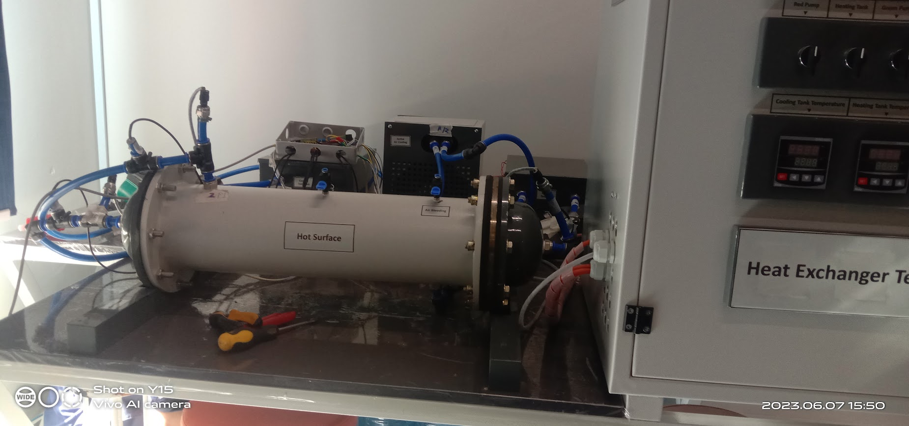
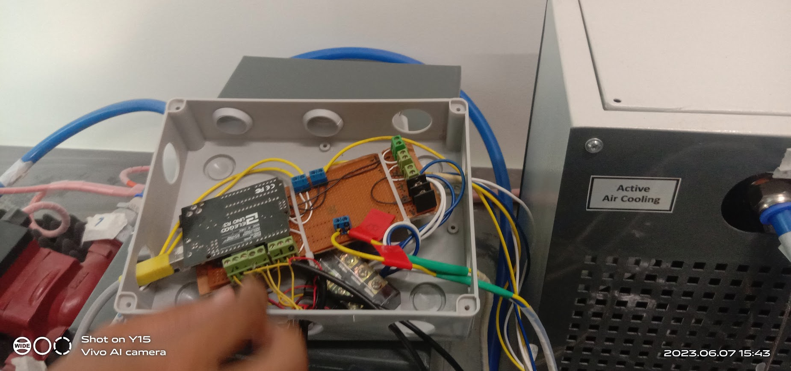
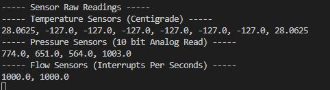

  <h1>Heat-Exchanger-Sensors-Reader</h1>
  
<h3 align="center">Controller for Shell and Tube Heat Exchanger Sensors Readings Data Collection for Analysis 🚀</h3>

## Info
- Live Shell and Tube Heat Exchanger Temperature, Pressure and Flow Readings Monitoring
- Save Real Time Sensor Data in csv file for further analysis or graph plotting

### Heat Exchange Setup

### Controller Board

### Raw Readings from Controller

## Included in Repo
- Arduino Firmware (For collecting data from sensors)
- Python script (for Reading, Callibration, Display and Saving to CSV)

## Sensors and Readings

### Temperture Sensors
- "tempTubeIn"
- "tempTubeOut"

- "tempShellIn"
- "tempShell1"
- "tempShell2"
- "tempShell3"
- "tempShell4"
- "tempShellOut"

### Pressure Sensors
- "pressureTubeIn"
- "pressureTubeOut"
- "pressureShellIn"
- "pressureShellOut"

### Flow Sensors
- "flowRateTube"
- "flowRateShell"

## Components Used
- Arduino Uno
- Shell and Tube Heat Exchanger
- 8x DS18B20 1-Wire Digital Temperature Sensor
- 4x pressure transducer
- 2x hall-effect flowrate sensor

# 📝 Documentation

# 📚 References

# 🤝🏻 Connect with Me

# 📜 License

Licensed under the GPL3 License, Copyright 2025 Huzaifa Irfan. [LICENSE](LICENSE)
